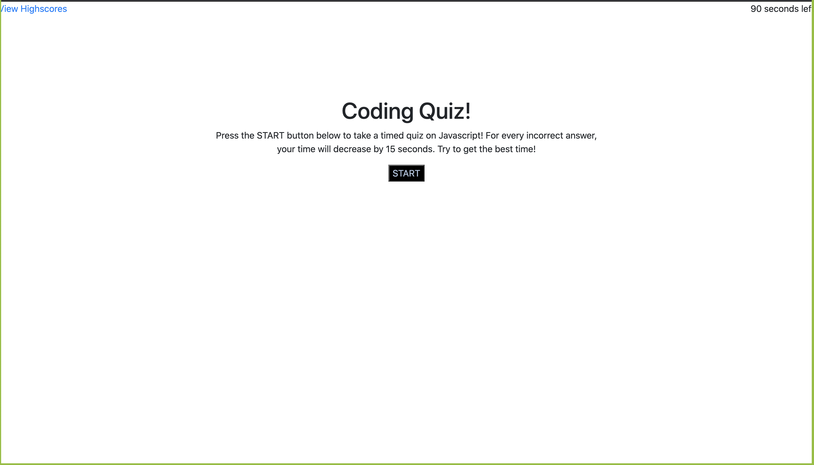

# codeQuizHW

# passwordGenerator

## Description

Using HTML, CSS, Bootstrap, and Javascript I created an application that quizzes the user on some aspects of Javascript, and saves the high scores to local storage. The user can view high scores, or take the quiz, and then save their initials and get on the leaderboard. The order of questions and answers are both randomized.

## Usage

Click the start button to start the quiz, or go view high scores. Simply click on e answer you choose, and it'll take you to the next question. A word will pop up at the bottom, either correct or incorrect, telling you about the last question. At the end, simply add your initials to save your high score!

## Link to Application

https://tmessall.github.io/codeQuizHW/